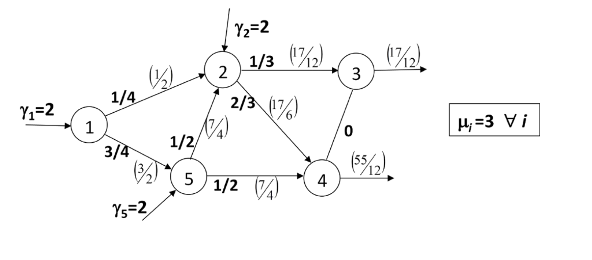
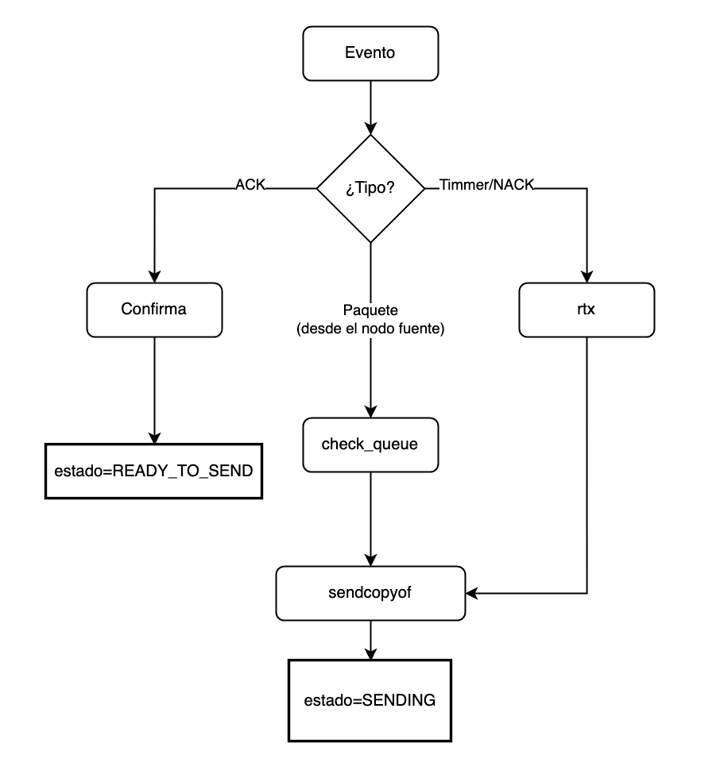
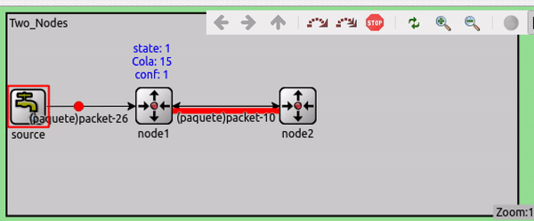
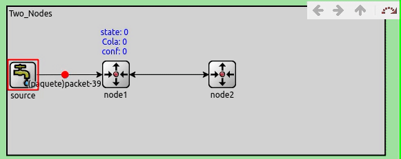
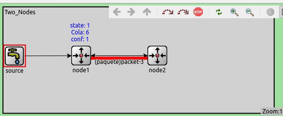

# Repositorio para omnetpp de RRT

## Resumen

En este repositorio se encuentran todas las fuentes de codugo usabas para la realizacion de silulaciones de protocolos ARQ usando Omnetpp.

### Enunciado

El objetivo es realizar la simulacion de una red tipo Jackson para estudiar el rendimiento de diferentes protocolos a nivel ARQ, lo protocolos que se estudiaran seran:

- Sin protocolo (FIFO)
- Stop & Wait
- Go-Back-N



#### Stop & Wait

Condiciones de stop and wait

1. Se transmiten Packetes normales, Ack y Nack.
2. Se puede recuperar por ACK y NACK y timmer.
3. Los paquetes de la cola tienen prioridad sobre los que llegan.

##### Funcionamiento

Cuando el nodo A envia un paquete al nodo B pueden ocurrir 3 cosas, que se envie correctamente, que el paquete llegue con error al nodo B o que el paquete se pierda y no llegue nunca a l nodo B.

###### Diagrama de estados básico

<p align="center">
   
<p/>

###### Gestion de eventos

<p align="center">
   
<p/>

###### Ejemplos

- Envio sin error

<p align="center">
   
<p/>

- Recuperacion por NACK

<p align="center">
   
<p/>

- Recuperacion por Timer

<p align="center">
   
<p/>

##### Funcionamiento

El modelo tiene 3 tipos de nodos

1. Nodo fuente
   El nodo fuente es el encargado de generar los paquetes añadiendoles un indentificador numerico y un timestamp

2. Nodo exterior
   Los nodos exteriores se encargan de introducir trafico dentro de la red 'core', la idea de que hagan de frontera ser capaz de poder gestionar que flujos de trafico actual existen.

3. Nodo core
   Es el encargado de rutar trafico, nada mas.

##### Funciones

Existen 2 funiones basicas para que S&W, se ha intentado hacer modular con lo que un solo modulo puede implementar todas las funciones

1. s_w_sender
   `s_w_sender(msg, "packet_in", "in2", "out2", channel_out2);`

es la encargada de enviar paquetes de TRAFICO a otro nodo.
Parametros:

- msg: el mensaje a rutar
- entradas (ins): entradas de trafico al nodo
- Saliddas (outs): por donde el paquete sera enviado

##### logica de rutado

La logica de rutado es simple en funcion de la probabilidad se rutara hacia un destino o hacia otro

```c++
  if((rand()%100)<prob){
      s_w_sender(msg_cp, "in2", "out2", channel_out2);
    }else{
        s_w_sender(msg_cp, "in3", "out3", channel_out3);
    }
```

1. s_w_receiver
   ```c++
     virtual int s_w_receiver(cMessage *msg,const char* input,const char *output);
   ```
   Es la encargada de generar acks cuando se recibe un paquete.

#### Go-BackN
