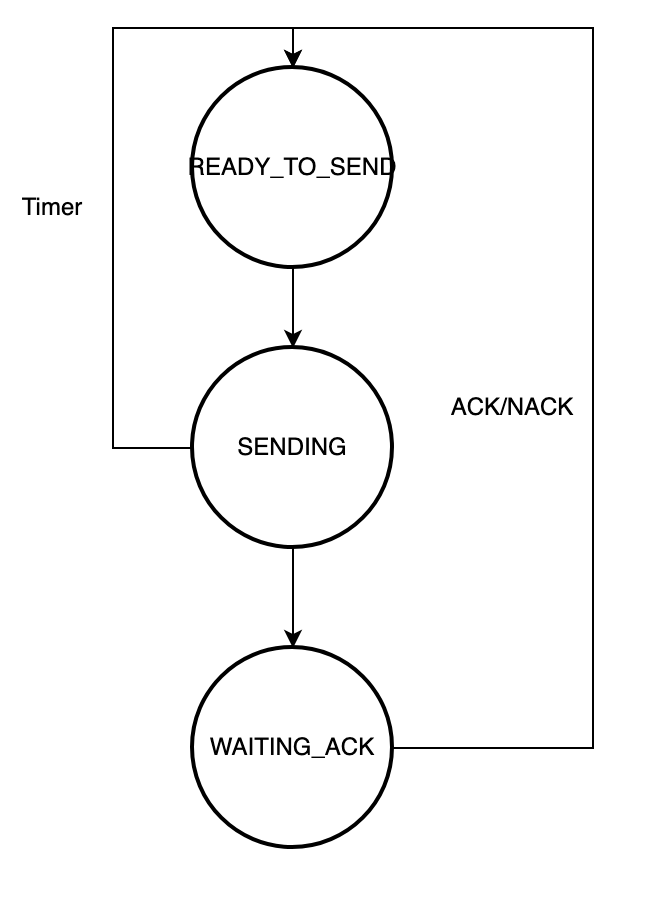

# Repositorio para omnetpp de RRT

## Resumen

En este repositorio se encuentran todas las fuentes de codugo usabas para la realizacion de silulaciones de protocolos ARQ usando Omnetpp.

### Enunciado

El objetivo es realizar la simulacion de una red tipo Jackson para estudiar el rendimiento de diferentes protocolos a nivel ARQ, lo protocolos que se estudiaran seran:

- Sin protocolo (FIFO)
- Stop & Wait
- Go-Back-N

#### Stop & Wait

Condiciones de stop and wait

1. Se transmiten Packetes normales, Ack y Nack.
2. Se puede recuperar por ACK y NACK y timmer.
3. Los paquetes de la cola tienen prioridad sobre los que llegan.

##### Funcionamiento

Cuando el nodo A envia un paquete al nodo B pueden ocurrir 3 cosas, que se envie correctamente, que el paquete llegue con error al nodo B o que el paquete se pierda y no llegue nunca a l nodo B.

###### Diagrama de estados básico

   

###### Gestion de eventos

   

###### Ejemplos

- Envio sin error

   

- Recuperacion por NACK

   

- Recuperacion por Timer

   

