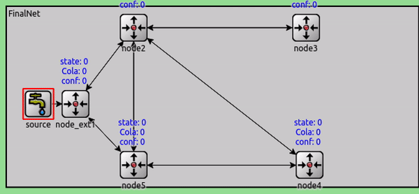

# Repositorio para omnetpp de RRT

## Resumen

En este repositorio se encuentran todas las fuentes de codugo usabas para la realizacion de silulaciones de protocolos ARQ usando Omnetpp.

### Enunciado

El objetivo es realizar la simulacion de una red tipo Jackson para estudiar el rendimiento de diferentes protocolos a nivel ARQ, lo protocolos que se estudiaran seran:

- Sin protocolo (FIFO)
- Stop & Wait
- Go-Back-N


#### Stop & Wait

Condiciones de stop and wait

1. Se transmiten Packetes normales, Ack y Nack.
2. Se puede recuperar por ACK y NACK y timmer.
3. Los paquetes de la cola tienen prioridad sobre los que llegan.

##### Funcionamiento

Cuando el nodo A envia un paquete al nodo B pueden ocurrir 3 cosas, que se envie correctamente, que el paquete llegue con error al nodo B o que el paquete se pierda y no llegue nunca a l nodo B.

###### Diagrama de estados básico

<p align="center">
   
<p/>

###### Gestion de eventos

<p align="center">
   
<p/>

###### Ejemplos

- Envio sin error

<p align="center">
   
<p/>

- Recuperacion por NACK

<p align="center">
   
<p/>

- Recuperacion por Timer

<p align="center">
   
<p/>

##### Funcionamiento

El modelo tiene 3 tipos de nodos

1. Nodo fuente
   El nodo fuente es el encargado de generar los paquetes añadiendoles un indentificador numerico y un timestamp

   - Generacion de trafico
     Para el objeto de esta practica se ha generado trafico de 2 maneras una aleatoria (simple) y la otra a rafagas o 'burst'

   El codigo de la figura ilustra como se ha generado ese trafico.

   ```c++
    void BurstyGenerator::handleMessage(cMessage *msg)
    {
        // generate & send packet
        cMessage *pkt = new cMessage;
        send(pkt, "out");
        // if this was the last packet of the burst
        if (--burstCounter == 0) {
            // schedule next burst
            burstCounter = burstLength;
            scheduleAt(simTime()+exponential(5.0), msg);
        }
        else {
            // schedule next sending within burst
            scheduleAt(simTime()+exponential(1.0), msg);
        }
    }
   ```

2. Nodo exterior
   Los nodos exteriores se encargan de introducir trafico dentro de la red 'core', la idea de que hagan de frontera ser capaz de poder gestionar que flujos de trafico actual existen.

3. Nodo core
   Es el encargado de rutar trafico, nada mas.

4. Canales

   Para los canales se uso la clase DatarateChannel que da omnetpp al que podemos darle parametros

   ```c++
   channel eth_100bps extends DatarateChannel
        {
            datarate = 10bps;
        }
        channel eth_10000bps extends DatarateChannel
        {
            datarate =  10000bps;
        }
        ....
   ```

##### Objeto cPacket

Se usa un tipo de paquete custom que tienen como parametros los siguientes atributos

```c++
packet paquete
{
    //0 normal 1 ack 2 nack
    unsigned int seq; //numero de secuencia
    unsigned short type; //tipo de paquete
    double startTimeStamp; // marca de tiempo inicial
    double endTimeStamp; // marca de tiempo final
    unsigned int input; //nodo de entrada
    unsigned int output; // nodo de salida


}
```

##### Funciones

Existen 2 funiones basicas para que S&W, se ha intentado hacer modular con lo que un solo modulo puede implementar todas las funciones

1. s_w_sender
   ```c++
   s_w_sender(msg, "packet_in", "in2", "out2", channel_out2);
   ```

es la encargada de enviar paquetes de TRAFICO a otro nodo.
Parametros:

- msg: el mensaje a rutar
- entradas (ins): entradas de trafico al nodo
- Saliddas (outs): por donde el paquete sera enviado

##### logica de rutado

La logica de rutado es simple en funcion de la probabilidad se rutara hacia un destino o hacia otro

```c++
  if((rand()%100)<prob){
      s_w_sender(msg_cp, "in2", "out2", channel_out2);
    }else{
        s_w_sender(msg_cp, "in3", "out3", channel_out3);
    }
```

1. s_w_receiver
   ```c++
     virtual int s_w_receiver(cMessage *msg,const char* input,const char *output);
   ```
   Es la encargada de generar acks cuando se recibe un paquete.

### Simulaciones S&W

Casuisticas analizadas

A la hora de analizar la red se pretendio cubrir todos los aspectos estudiando el impacto de: tipo de canales de datos, logica de rutado diferentes y nodos (por ejemplo congestionar un nodo de manera deliverada).

1. Nodo congestionado

<p align="center">
   
<p/>

Canales de igual capacidad

<p align="center">
   
<p/>

Flujo unico

<p align="center">
   
<p/>

#### Resultados

#### Go-BackN

Condiciones de GoBack-N

1. Se transmiten Packetes normales, Ack y Nack. - [x]
2. Se puede recuperar por ACK y NACK - [x]
3. Se puede recuperar por Timer - []
4. Los paquetes de la cola tienen prioridad sobre los que llegan.- [x]
5. Es posible confirmar varios paquetes a la vez - [x]
6. Cuando llega un nak se desacartan todos los paquetes anteriores - [x]

#### Diagrama de estados

##### Estados

<p align="center">
   
<p/>

##### Eventos

<p align="center">
   
<p/>

##### Funcionamiento

Con GBN se puede enviar hasta que una ventana con un determinado tamaño se vacia, con lo que es necesario deslizar la ventana cuando se recibien ACKs que indican que un paquete se ha enviado bien.

#### Ejemplos

1. GBN basico

Funcionamiento basico, el trasmisor envia hasta que la ventana se llena

<p align="center">
   
<p/>

2. GBN multi-ack

Cuando el receptor en envia un ack se vacian todos los paquetes anteriores

<p align="center">
   
<p/>

## Problemas encontrados

1. Maquina virtual de 2GB

2. Programacion de protocolos: para poder probar de manera consistente el rendimiento de estos protocolos ARQ es necesario que el protocolo este bien implementado, eso lleva tiempo, considero que salvo la ausencia de recupperacion por timme en el caso de Go-Back-N la implementacion de cada protocolo esta bien lograda y testeada en diferentes escenario. Despues el paso siguiente habria sido el de sacar estadisticas.

## Conclusiones

Programar este tipo de modelos es bastante cercano a acercarse a como se puede comportar una targeta de red o un driver de red.
Por ejemplo a la hora de codificar un protocolo hay que abstraerse y pensar a como se cmportaria un driver de red, con lo que es necesario programar pensando en recursos y en memoria optimizando.
